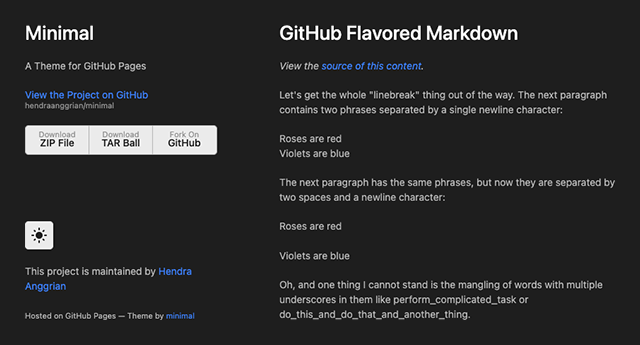

[](https://plugins.gradle.org/plugin/com.hendraanggrian.pages/)
[](https://travis-ci.com/github/hendraanggrian/pages-gradle-plugin/)
[](https://openjdk.java.net/projects/jdk8/)

# Pages Gradle Plugin

Static webpages generator for GitHub pages.

## Download

Using plugins DSL:

```gradle
plugins {
    id('com.hendraanggrian.pages') version "$version"
}
```

Using legacy plugin application:

```gradle
buildscript {
    repositories {
        gradlePluginPortal()
    }
    dependencies {
        classpath("com.hendraanggrian:pages-gradle-plugin:$version")
    }
}

apply plugin: 'com.hendraanggrian.pages'
```

## Usage

On its own main dependency, the plugin does nothing. Declare a feature by invoking `requireCapability`.

### Feature: [Minimal](https://github.com/hendraanggrian/minimal-theme/)



At the moment, this is the only feature.

```gradle
dependencies {
    classpath("com.hendraanggrian:pages-gradle-plugin:$version") {
        capabilities {
            requireCapability('com.hendraanggrian:pages-minimal')
        }
    }
}
```

Configure minimal theme by invoking `minimal` DSL.

```gradle
plugins {
    id('com.hendraanggrian.pages')
}

pages {
    minimal {
        authorName.set('Hendra Anggrian')
        projectName.set('My Project')
        projectDescription.set('A very awesome project')
        markdownFile.set(file('path/to/README.md'))
        headerButtons {
            button('Download', 'Sources', 'https://somewhere.com')
        }
    }
}
```
